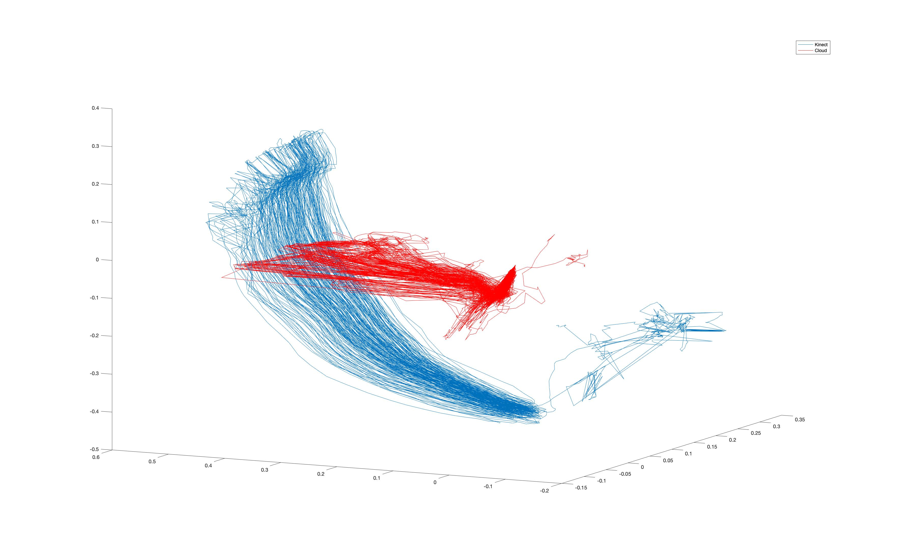
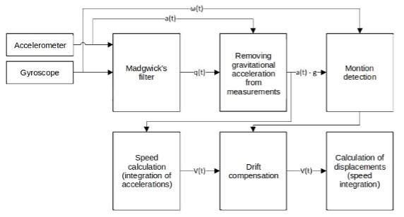

# Realtime 3D Arm tracking 
## Arm model

Above is the model of human arm. The location of the hand can be determined by several joints angles as well as two lengths. Given a certain orientation of the wrist, there can be many solutions to arm posture, which forms a point clouds.Each time step corresponds to a new point cloud. The task is to find the trace of the wrist of the maximum likelyhood which is done by HMM. Different heuristic methods are used to reduce complexity, which include reduce point cloud density, delete unlikely point cloud. The ultimate goal is to reduce complexity and increase accuracy.  

### Simple solution
One might simply use the average of the point cloud of each time step. However, it suffers from high error for certain postures.

## data capture
### Baseline data:
We use Microsoft Kinect to obtain the spatial location of shoulder,elbow and hand. A person is asked to perform a series of different action such as waving and punching. Spatial data is recorded by Kinect and convert to the relative coordinate.
### Experiemnt data
We use both both smart phone and M5StickC ESP32 to obtain acceleration, gyroscope, magnetic sensor. These divices are attached to the front end of the person and perform the same action as above. 
#### ``M5 Stack`` folder is the source code of data collection from ``M5StickC ESP32`` module, 
## data processing
### calibration
Both accelerator sensor and gyroscope suffers from low and high frequency noise. If we perform direct intergration, there will be large shift. Calibration is performed prior to the test. Calibration is also done to Kinect.
### Filtering
#### Raw data from above test is passed to several filters to solve drift issue. Process is shown below.

### HMM
#### HMM model is used to solve unique spatial location of the hand by a physical model and readings from sensors.
#### Definition of model: Emission: Orientation estimation from IMU units. Hidden state: angles of each joint
#### Result:

The graph above shows result in different dimensions. It is measured by the relative distance from the Kinect groundtruth and HMM prediction. A faster solution is done by averaging of points cloud.
## Conclusion
This part of project intend to provide a highly efficient model to estimate spatial location of the wrist by IMU reading such as a smart watch. Another part of the project is done by deep learning model (LSTM). Then, the arm model can provide more valuable information rather than pure point cloud location to train the network further increase the efficiency. 