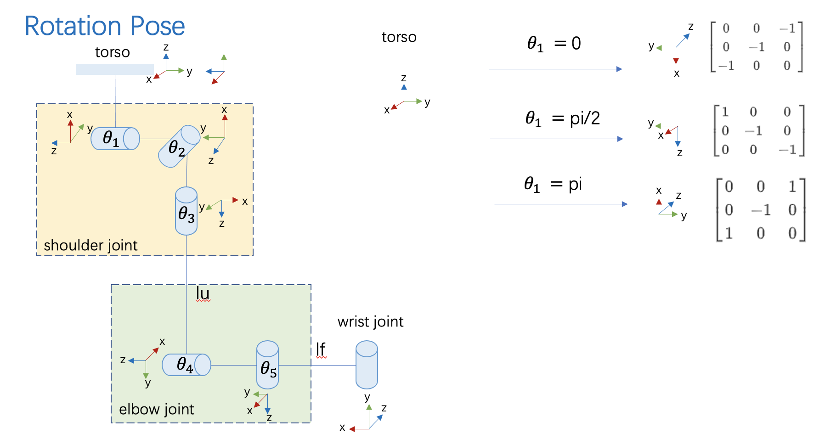
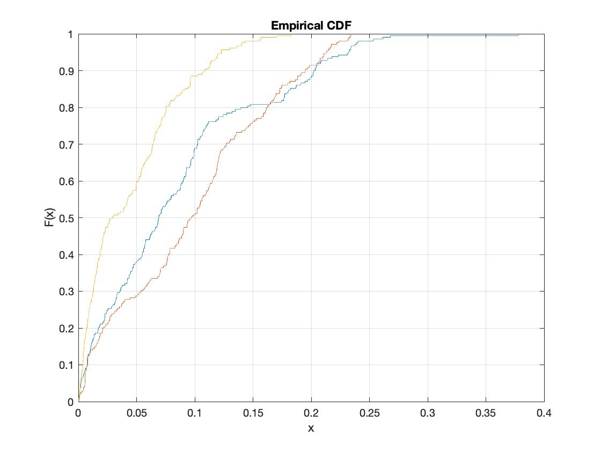

# Realtime 3D Arm tracking 
## Arm model

Above is the model of human arm. The location of the hand can be determined by several joints angles as well as two lengths. 
## data capture
### Baseline data:
#### We use Microsoft Kinect to obtain the spatial location of shoulder,elbow and hand. A person is asked to perform a series of different action such as waving and punching. Spatial data is recorded by Kinect and convert to the relative coordinate.
### Experiemnt data
#### We use both both smart phone and M5StickC ESP32 to obtain acceleration, gyroscope, magnetic sensor. These divices are attached to the front end of the person and perform the same action as above. 
#### ``M5 Stack`` folder is the source code of data collection from M5StickC ESP32 module 
## data processing
### calibration
#### Both accelerator sensor and gyroscope suffers from low and high frequency noise. If we perform direct intergration, there will be large shift. Calibration is performed prior to the test.
### Filtering
#### Raw data from above test is passed to several filters to solve drift issue.
### HMM
#### HMM model is used to solve unique spatial location of the hand by a physical model and readings from sensors.
#### Definition of model: Emission: Orientation estimation from IMU units. Hidden state: angles of each joint
#### Result:

The graph above shows result in different dimensions. It is measured by the relative distance from the Kinect groundtruth and HMM prediction. A faster solution is done by averaging of points cloud.
